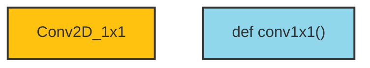
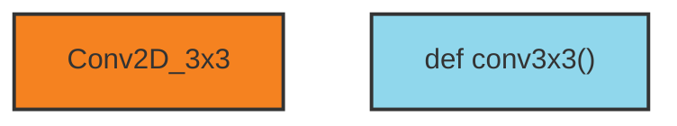
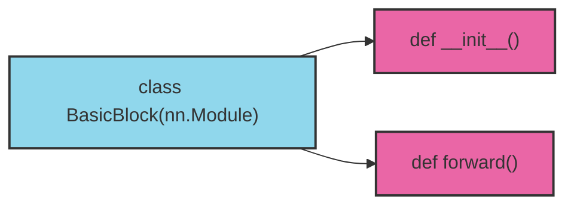
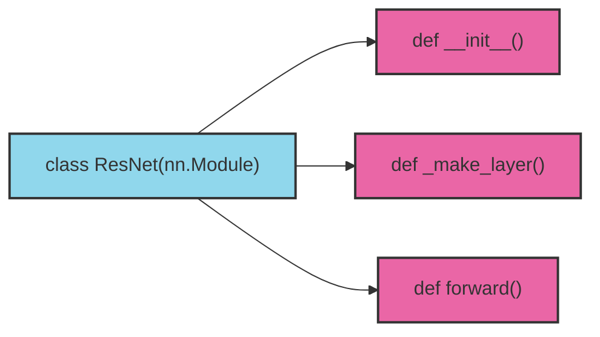
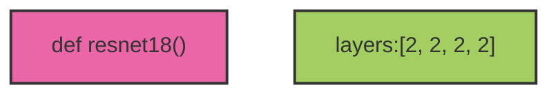
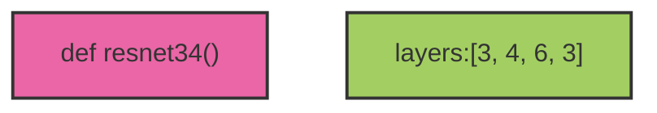
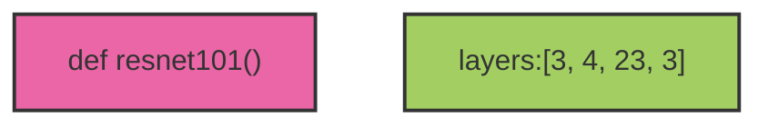

import Tabs from '@theme/Tabs';
import TabItem from '@theme/TabItem';

### ResNet 网络结构

#### ResNet 的残差结构


#### 基本残差块


- `BasicBlock` 经过两个 3x3 的卷积层，再与输入相加后激活输出

- `BottleNeck` 用于更深层的 `resnet` 网络，先经过一个 1x1 、一个 3x3 的卷积层后，再通过一个 1x1 的卷积层改变通道数，再与输入相加后激活输出
---

### ResNet 网络

ResNet 的网络结构就是通过基础残差块叠加来搭建


---

### PyTorch 实现 ResNet

#### 基础模块

**`1x1` 卷积块**


<Tabs>
<TabItem value="py" label="Python">

``` py
def conv1x1(in_planes, out_planes, stride=1):
    return nn.Conv2d(in_planes, 
                     out_planes, 
                     stride=stride,
                     kernel_size=1, 
                     bias=False)
```

</TabItem>
<TabItem value="C++" label="C++">

``` cpp
static torch::nn::Conv2dOptions create_conv1x1_options(int64_t in_planes,
                                                       int64_t out_planes,
                                                       int64_t stride = 1)
{
    torch::nn::Conv2dOptions conv_opt = create_conv_options(
            in_planes
            , out_planes
            , 1
            , stride
            , 0 /*padding */
            , 1  /*groups */
            , 1 /*dilation */
            , false);
    return conv_opt;
}
```

</TabItem>
</Tabs>

---

**`3x3` 卷积块**


<Tabs>
<TabItem value="py" label="Python">

``` py
def conv3x3(in_planes, out_planes, stride=1):
    return nn.Conv2d(in_planes,
                     out_planes,
                     kernel_size=3,
                     stride=stride,
                     padding=1,
                     bias=False)
```

</TabItem>
<TabItem value="C++" label="C++">

``` cpp
static torch::nn::Conv2dOptions create_conv3x3_options(int64_t in_planes,
                                                       int64_t out_planes,
                                                       int64_t stride = 1,
                                                       int64_t groups = 1,
                                                       int64_t dilation = 1)
{
    torch::nn::Conv2dOptions conv_opt = create_conv_options(
            in_planes,
            out_planes,
            3, /* kernel_size */
            stride,
            dilation, /* padding */
            groups,
            dilation, /* dilation */
            false);
    return conv_opt;
}
```

</TabItem>
</Tabs>

---

**`BasicBlock` 残差块**



<Tabs>
<TabItem value="py" label="Python">

``` py
class BasicBlock(nn.Module):
    expansion = 1

    def __init__(self, in_planes, planes, stride=1, down_sample=None):
        super(BasicBlock, self).__init__()
        self.conv_1 = conv3x3(in_planes, planes, stride)
        self.bn_1 = nn.BatchNorm2d(planes)
        self.relu = nn.ReLU()
        self.conv_2 = conv3x3(planes, planes)
        self.bn_2 = nn.BatchNorm2d(planes)
        self.down_sample = down_sample
        self.stride = stride

    def forward(self, x):
        identity = x

        out = self.conv_1(x)
        out = self.bn_1(out)
        out = self.relu(out)
        out = self.conv_2(out)
        out = self.bn_2(out)
        if self.down_sample is not None:
            identity = self.down_sample(x)

        out += identity
        out = self.relu(out)

        return out
```

</TabItem>
<TabItem value="C++" label="C++">

``` cpp
struct BasicBlock : torch::nn::Module {
    BasicBlock(int64_t in_planes, int64_t planes, int64_t stride = 1,
               torch::nn::Sequential down_sample = torch::nn::Sequential(),
               int64_t groups = 1, int64_t base_width = 64,
               int64_t dilation = 1)
    {
        if ((groups != 1) || (base_width != 64))
        {
            throw std::invalid_argument{
                    "BasicBlock only supports groups=1 and base_width=64"};
        }
        if (dilation > 1)
        {
            throw std::invalid_argument{
                    "Dilation > 1 not supported in BasicBlock"};
        }
        m_conv_1 = register_module("conv_1", torch::nn::Conv2d{create_conv3x3_options(in_planes, planes, stride)});
        m_bn_1   = register_module("bn_1", torch::nn::BatchNorm2d{planes});
        m_relu   = register_module("relu", torch::nn::ReLU{true});
        m_conv_2 = register_module("conv_2", torch::nn::Conv2d{create_conv3x3_options(planes, planes)});
        m_bn_2   = register_module("bn_2", torch::nn::BatchNorm2d{planes});
        if (!down_sample->is_empty())
        {
            m_down_sample = register_module("down_sample", down_sample);
        }
        m_stride = stride;
    }

    static const int64_t m_expansion = 1;

    torch::nn::Conv2d       m_conv_1{nullptr};
    torch::nn::Conv2d       m_conv_2{nullptr};
    torch::nn::BatchNorm2d  m_bn_1{nullptr};
    torch::nn::BatchNorm2d  m_bn_2{nullptr};
    torch::nn::ReLU         m_relu{nullptr};
    torch::nn::Sequential   m_down_sample = torch::nn::Sequential();

    int64_t m_stride;

    torch::Tensor forward(const torch::Tensor& x)
    {
        torch::Tensor identity = x;

        torch::Tensor out;
        out = m_conv_1  -> forward(x);
        out = m_bn_1    -> forward(out);
        out = m_relu    -> forward(out);

        out = m_conv_2  -> forward(out);
        out = m_bn_2    -> forward(out);

        if (!m_down_sample->is_empty())
        {
            identity = m_down_sample -> forward(x);
        }

        out += identity;
        out = m_relu    -> forward(out);

        return out;
    }
};
```

</TabItem>
</Tabs>

---

**`BottleNeck` 残差块**


<Tabs>
<TabItem value="py" label="Python">

``` py
class BottleNeck(nn.Module):
    expansion = 4

    def __init__(self, in_planes, planes, stride=1, down_sample=None):
        super(BottleNeck, self).__init__()
        self.conv_1 = conv1x1(in_planes, planes)
        self.bn_1 = nn.BatchNorm2d(planes)
        self.conv_2 = conv3x3(planes,
                                planes,
                                stride=stride)
        self.bn_2 = nn.BatchNorm2d(planes)
        self.conv_3 = conv1x1(planes, planes * 4)
        self.bn_3 = nn.BatchNorm2d(planes * 4)
        self.relu = nn.ReLU()
        self.down_sample = down_sample
        self.stride = stride

    def forward(self, x):
        identity = x

        out = self.conv_1(x)
        out = self.bn_1(out)
        out = self.relu(out)

        out = self.conv_2(out)
        out = self.bn_2(out)
        out = self.relu(out)

        out = self.conv_3(out)
        out = self.bn_3(out)

        if self.down_sample is not None:
            identity = self.down_sample(x)

        out += identity
        out = self.relu(out)

        return out
```

</TabItem>
<TabItem value="C++" label="C++">

``` cpp
struct Bottleneck : torch::nn::Module
{
    Bottleneck(int64_t in_planes, int64_t planes, int64_t stride = 1,
               torch::nn::Sequential down_sample = torch::nn::Sequential(),
               int64_t groups = 1, int64_t base_width = 64,
               int64_t dilation = 1)
    {
        int64_t width = planes * (base_width / 64) * groups;

        m_conv_1 = register_module("conv_1",torch::nn::Conv2d{create_conv1x1_options(in_planes, width)});
        m_bn_1   = register_module("bn_1",torch::nn::BatchNorm2d{width});
        m_conv_2 = register_module("conv_2",torch::nn::Conv2d{create_conv3x3_options(width, width, stride, groups, dilation)});
        m_bn_2   = register_module("bn_2",torch::nn::BatchNorm2d{width});
        m_conv_3 = register_module("conv_3",torch::nn::Conv2d{create_conv1x1_options(width, planes * m_expansion)});
        m_bn_3   = register_module("bn_3",torch::nn::BatchNorm2d{planes * m_expansion});
        m_relu   = register_module("relu",torch::nn::ReLU{true});
        if (!down_sample->is_empty())
        {
            m_down_sample = register_module("down_sample", down_sample);
        }
        m_stride = stride;
    }

    static const int64_t m_expansion = 4;

    torch::nn::Conv2d       m_conv_1{nullptr};
    torch::nn::Conv2d       m_conv_2{nullptr};
    torch::nn::Conv2d       m_conv_3{nullptr};
    torch::nn::BatchNorm2d  m_bn_1{nullptr};
    torch::nn::BatchNorm2d  m_bn_2{nullptr};
    torch::nn::BatchNorm2d  m_bn_3{nullptr};
    torch::nn::ReLU         m_relu{nullptr};
    torch::nn::Sequential   m_down_sample = torch::nn::Sequential();

    int64_t m_stride;

    torch::Tensor forward(const torch::Tensor& x)
    {
        torch::Tensor identity = x;

        torch::Tensor out;
        out = m_conv_1  -> forward(x);
        out = m_bn_1    -> forward(out);
        out = m_relu    -> forward(out);

        out = m_conv_2  -> forward(out);
        out = m_bn_2    -> forward(out);
        out = m_relu    -> forward(out);

        out = m_conv_3  -> forward(out);
        out = m_bn_3    -> forward(out);

        if (!m_down_sample->is_empty())
        {
            identity = m_down_sample -> forward(x);
        }

        out += identity;
        out = m_relu    -> forward(out);

        return out;
    }
};
```

</TabItem>
</Tabs>

---

#### 网络堆叠


网络层数通过 `layers[]` 进行设置

``` py
def __init__(self, block, layers, num_classes = 1000):
    self.in_planes = 64
    ···
    self.layer_1 = self._make_layer(block, 64, layers[0])
    self.layer_2 = self._make_layer(block, 128, layers[1], stride=2)
    self.layer_3 = self._make_layer(block, 256, layers[2], stride=2)
    self.layer_4 = self._make_layer(block, 512, layers[3], stride=2)
    ···
```

``` py
def _make_layer(self, block, planes, blocks, stride=1):
    ···
    layers = []
    layers.append(block(self.in_planes, planes, stride, down_sample))
    self.in_planes = planes * block.expansion
    for i in range(1, blocks):
        layers.append(block(self.in_planes, planes))

    return nn.Sequential(*layers)
```

<Tabs>
<TabItem value="py" label="Python">

``` py
class ResNet(nn.Module):
    def __init__(self, block, layers, num_classes = 1000):
        self.in_planes = 64
        super(ResNet, self).__init__()
        self.conv_1 = nn.Conv2d(3,
                                64,
                                kernel_size=7,
                                stride=2,
                                padding=3,
                                bias=False)
        self.bn_1 = nn.BatchNorm2d(64)
        self.relu = nn.ReLU()
        self.max_pool = nn.MaxPool2d(kernel_size=3, stride=2, padding=1)
        self.layer_1 = self._make_layer(block, 64, layers[0])
        self.layer_2 = self._make_layer(block, 128, layers[1], stride=2)
        self.layer_3 = self._make_layer(block, 256, layers[2], stride=2)
        self.layer_4 = self._make_layer(block, 512, layers[3], stride=2)
        self.avgpool = nn.AdaptiveAvgPool2d((1, 1))
        self.fc = nn.Linear(512 * block.expansion, num_classes)

        for m in self.modules():
            if isinstance(m, nn.Conv2d):
                n = m.kernel_size[0] * m.kernel_size[1] * m.out_channels
                nn.init.uniform_(m.weight, 0, math.sqrt(2. / n))
            elif isinstance(m, nn.BatchNorm2d):
                nn.init.ones_(m.weight)
                nn.init.zeros_(m.bias)

    def _make_layer(self, block, planes, blocks, stride=1):
        down_sample = None
        if stride != 1 or self.in_planes != planes * block.expansion:
            down_sample = nn.Sequential(
                nn.Conv2d(self.in_planes,
                          planes * block.expansion,
                          kernel_size=1,
                          stride=stride,
                          bias=False),
                nn.BatchNorm2d(planes * block.expansion),
            )

        layers = []
        layers.append(block(self.in_planes, planes, stride, down_sample))
        self.in_planes = planes * block.expansion
        for i in range(1, blocks):
            layers.append(block(self.in_planes, planes))

        return nn.Sequential(*layers)

    def forward(self, x):
        x = self.conv_1(x)
        x = self.bn_1(x)
        x = self.relu(x)
        x = self.max_pool(x)

        x = self.layer_1(x)
        x = self.layer_2(x)
        x = self.layer_3(x)
        x = self.layer_4(x)
        x = self.avgpool(x)
        x = torch.flatten(x, 1)
        x = self.fc(x)

        return x
```

</TabItem>
<TabItem value="C++" label="C++">

``` cpp
template <typename Block>
struct ResNet_Base : torch::nn::Module
{
    explicit ResNet_Base(const std::vector<int64_t>& layers
        , int64_t num_classes = 1000
        , bool zero_init_residual = false
        , int64_t groups = 1
        , int64_t width_per_group = 64
        , std::vector<int64_t> replace_stride_with_dilation = {})
    {
        if (replace_stride_with_dilation.empty())
        {
            replace_stride_with_dilation = {false, false, false};
        }
        if (replace_stride_with_dilation.size() != 3)
        {
            throw std::invalid_argument{
                "replace_stride_with_dilation should be empty or have exactly "
                "three elements."
            };
        }
        m_groups = groups;
        m_base_width = width_per_group;

        m_conv_1 = register_module("conv_1"
                , torch::nn::Conv2d{create_conv_options(3           /*in_planes = */
                                                        , m_in_planes   /*out_planes = */
                                                        , 7             /*kernel_size = */
                                                        , 2                 /*stride = */
                                                        , 3               /*padding = */
                                                        , 1                /*groups = */
                                                        , 1                /*dilation = */
                                                        , false)});           /*bias = */

        m_bn_1 = register_module("bn_1", torch::nn::BatchNorm2d{m_in_planes});
        m_relu = register_module("relu", torch::nn::ReLU{true});
        m_max_pool = register_module("max_pool"
                , torch::nn::MaxPool2d{torch::nn::MaxPool2dOptions({3, 3})
                    .stride({2, 2})
                    .padding({1, 1})});

        m_layer_1 = register_module("layer_1"
                , _makeLayer(64, layers.at(0)));
        m_layer_2 = register_module("layer_2"
                , _makeLayer(128, layers.at(1), 2, replace_stride_with_dilation.at(0)));
        m_layer_3 = register_module("layer_3"
                , _makeLayer(256, layers.at(2), 2, replace_stride_with_dilation.at(1)));
        m_layer_4 = register_module("layer_4"
                , _makeLayer(512, layers.at(3), 2, replace_stride_with_dilation.at(2)));

        m_avg_pool = register_module("avg_pool"
                , torch::nn::AdaptiveAvgPool2d(torch::nn::AdaptiveAvgPool2dOptions({1, 1})));

        m_fc = register_module(
                "fc", torch::nn::Linear(512 * Block::m_expansion, num_classes));

        for (const auto& m : modules(false))
        {
            if (m->name() == "torch::nn::Conv2dImpl")
            {
                torch::OrderedDict<std::string, torch::Tensor> named_parameters = m->named_parameters(false);
                torch::Tensor* ptr_w = named_parameters.find("weight");
                torch::nn::init::kaiming_normal_(*ptr_w, 0, torch::kFanOut,
                                                 torch::kReLU);
            }
            else if ((m->name() == "torch::nn::BatchNormImpl") || (m->name() == "torch::nn::GroupNormImpl"))
            {
                torch::OrderedDict<std::string, torch::Tensor> named_parameters;
                named_parameters = m->named_parameters(false);
                torch::Tensor* ptr_w = named_parameters.find("weight");
                torch::nn::init::constant_(*ptr_w, 1.0);
                torch::Tensor* ptr_b = named_parameters.find("bias");
                torch::nn::init::constant_(*ptr_b, 0.0);
            }
        }

        if (zero_init_residual)
        {
            for (const auto& m : modules(false))
            {
                if (m->name() == "Bottleneck")
                {
                    torch::OrderedDict<std::string, torch::Tensor> named_parameters;
                    named_parameters = m->named_modules()["bn3"]->named_parameters(false);
                    torch::Tensor* ptr_w = named_parameters.find("weight");
                    torch::nn::init::constant_(*ptr_w, 0.0);
                }
                else if (m->name() == "BasicBlock")
                {
                    torch::OrderedDict<std::string, torch::Tensor> named_parameters;
                    named_parameters = m->named_modules()["bn2"]->named_parameters(false);
                    torch::Tensor* ptr_w = named_parameters.find("weight");
                    torch::nn::init::constant_(*ptr_w, 0.0);
                }
            }
        }
    }

    int64_t m_in_planes = 64;
    int64_t m_dilation = 1;
    int64_t m_groups = 1;
    int64_t m_base_width = 64;

    torch::nn::Conv2d               m_conv_1{nullptr};
    torch::nn::BatchNorm2d          m_bn_1{nullptr};
    torch::nn::ReLU                 m_relu{nullptr};
    torch::nn::MaxPool2d            m_max_pool{nullptr};
    torch::nn::Sequential           m_layer_1{nullptr};
    torch::nn::Sequential           m_layer_2{nullptr};
    torch::nn::Sequential           m_layer_3{nullptr};
    torch::nn::Sequential           m_layer_4{nullptr};
    torch::nn::AdaptiveAvgPool2d    m_avg_pool{nullptr};
    torch::nn::Linear               m_fc{nullptr};

    torch::nn::Sequential _makeLayer(int64_t planes, int64_t blocks,
                                      int64_t stride = 1, bool dilate = false)
    {
        torch::nn::Sequential down_sample = torch::nn::Sequential();
        int64_t previous_dilation = m_dilation;
        if (dilate)
        {
            m_dilation *= stride;
            stride = 1;
        }
        if ((stride != 1) || (m_in_planes != planes * Block::m_expansion))
        {
            down_sample = torch::nn::Sequential(
                    torch::nn::Conv2d(create_conv1x1_options(m_in_planes
                            , planes * Block::m_expansion
                            , stride))
                    , torch::nn::BatchNorm2d(planes * Block::m_expansion));
        }

        torch::nn::Sequential layers;

        layers->push_back(Block(m_in_planes
                                , planes
                                , stride
                                , down_sample
                                , m_groups
                                , m_base_width
                                , previous_dilation));

        m_in_planes = planes * Block::m_expansion;
        for (int64_t i = 0; i < blocks; i++)
        {
            layers->push_back(Block(m_in_planes
                                    , planes
                                    , 1
                                    , torch::nn::Sequential()
                                    , m_groups
                                    , m_base_width, m_dilation));
        }

        return layers;
    }

    torch::Tensor _forward_impl(torch::Tensor x)
    {

        x = m_conv_1->forward(x);
        x = m_bn_1->forward(x);
        x = m_relu->forward(x);
        x = m_max_pool->forward(x);

        x = m_layer_1->forward(x);
        x = m_layer_2->forward(x);
        x = m_layer_3->forward(x);
        x = m_layer_4->forward(x);

        x = m_avg_pool->forward(x);
        x = torch::flatten(x, 1);
        x = m_fc->forward(x);

        return x;
    }

    torch::Tensor _forward_rm_fc(torch::Tensor x)
    {

        x = m_conv_1->forward(x);
        x = m_bn_1->forward(x);
        x = m_relu->forward(x);
        x = m_max_pool->forward(x);

        x = m_layer_1->forward(x);
        x = m_layer_2->forward(x);
        x = m_layer_3->forward(x);
        x = m_layer_4->forward(x);

        x = m_avg_pool->forward(x);
        x = torch::flatten(x, 1);
        x = torch::nn::functional::normalize(x, torch::nn::functional::NormalizeFuncOptions().dim(1));

        return x;
    }

    torch::Tensor forward(torch::Tensor x) { return _forward_impl(x); }
};
```

</TabItem>
</Tabs>

---

#### 构建网络








<Tabs>
<TabItem value="py" label="Python">

``` py
def resnet18():
    model = ResNet(BasicBlock, [2, 2, 2, 2])
    return model


def resnet34():
    model = ResNet(BasicBlock, [3, 4, 6, 3])
    return model


def resnet50():
    model = ResNet(BottleNeck, [3, 4, 6, 3])
    return model


def resnet101():
    model = ResNet(BottleNeck, [3, 4, 23, 3])
    return model
```

</TabItem>
<TabItem value="C++" label="C++">

``` cpp
template <class Block>
std::shared_ptr<ResNet_Base<Block>>
resNet_base(const std::vector<int64_t>& layers
        , int64_t num_classes = 1000
        , bool zero_init_residual = false
        , int64_t groups = 1
        , int64_t width_per_group = 64
        , const std::vector<int64_t>& replace_stride_with_dilation = {})
{
    std::shared_ptr<ResNet_Base<Block>> model = std::make_shared<ResNet_Base<Block>>(
            layers
            , num_classes
            , zero_init_residual
            , groups
            , width_per_group
            , replace_stride_with_dilation);

    return model;
}

static std::shared_ptr<ResNet_Base<BasicBlock>>
resNet18(int64_t num_classes = 1000
        , bool zero_init_residual = false
        , int64_t groups = 1
        , int64_t width_per_group = 64
        , const std::vector<int64_t>& replace_stride_with_dilation = {})
{
    const std::vector<int64_t> layers{2, 2, 2, 2};
    std::shared_ptr<ResNet_Base<BasicBlock>> model = resNet_base<BasicBlock>(
            layers
            , num_classes
            , zero_init_residual
            , groups
            , width_per_group
            , replace_stride_with_dilation);

    return model;
}

static std::shared_ptr<ResNet_Base<BasicBlock>>
resNet34(int64_t num_classes = 1000
        , bool zero_init_residual = false
        , int64_t groups = 1
        , int64_t width_per_group = 64
        , const std::vector<int64_t>& replace_stride_with_dilation = {})
{
    const std::vector<int64_t> layers{3, 4, 6, 3};
    std::shared_ptr<ResNet_Base<BasicBlock>> model = resNet_base<BasicBlock>(
            layers
            , num_classes
            , zero_init_residual
            , groups
            , width_per_group
            , replace_stride_with_dilation);

    return model;
}

static std::shared_ptr<ResNet_Base<Bottleneck>>
resNet50(int64_t num_classes = 1000
        , bool zero_init_residual = false
        , int64_t groups = 1
        , int64_t width_per_group = 64
        , const std::vector<int64_t>& replace_stride_with_dilation = {})
{
    const std::vector<int64_t> layers{3, 4, 6, 3};
    std::shared_ptr<ResNet_Base<Bottleneck>> model = resNet_base<Bottleneck>(
            layers
            , num_classes
            , zero_init_residual
            , groups
            , width_per_group
            , replace_stride_with_dilation);

    return model;
}

static std::shared_ptr<ResNet_Base<Bottleneck>>
resnet101(int64_t num_classes = 1000
        , bool zero_init_residual = false
        , int64_t groups = 1
        , int64_t width_per_group = 64
        , const std::vector<int64_t>& replace_stride_with_dilation = {})
{
    const std::vector<int64_t> layers{3, 4, 23, 3};
    std::shared_ptr<ResNet_Base<Bottleneck>> model = resNet_base<Bottleneck>(
            layers
            , num_classes
            , zero_init_residual
            , groups
            , width_per_group
            , replace_stride_with_dilation);

    return model;
}
```

</TabItem>
</Tabs>

#### 完整代码地址

- **[rcxxx/torch-resnet/py/model.py](https://github.com/rcxxx/torch-resnet)**

## 参考
- **[Deep Residual Learning for Image Recognition](https://arxiv.org/abs/1512.03385)**
- **[Deep residual networks pre-trained on ImageNet](https://pytorch.org/hub/pytorch_vision_resnet/)**
- **[vision/torchvision/models/resnet.py](https://github.com/pytorch/vision/blob/main/torchvision/models/resnet.py)**
- **[你必须要知道CNN模型：ResNet](https://zhuanlan.zhihu.com/p/31852747)**