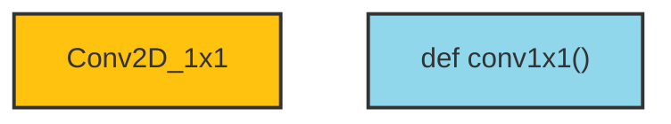
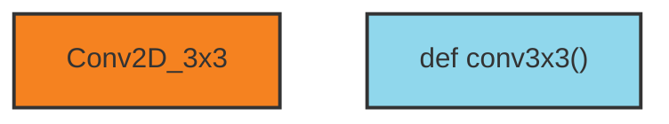
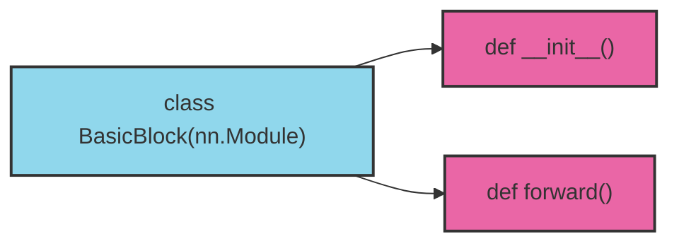
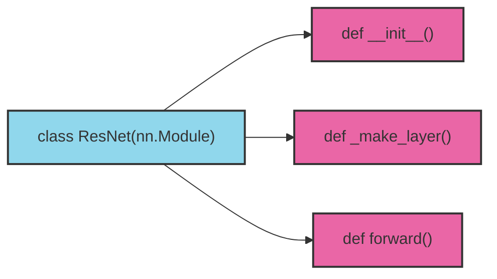
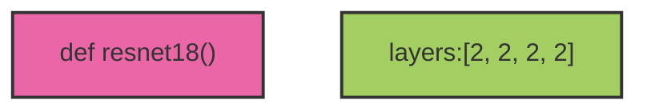
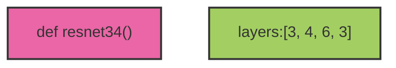
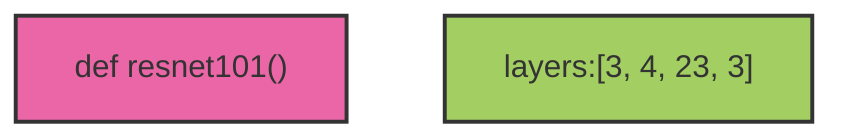

### ResNet 网络结构

#### ResNet 的残差结构


#### 基本残差块


- `BasicBlock` 经过两个 3x3 的卷积层，再与输入相加后激活输出

- `BottleNeck` 用于更深层的 `resnet` 网络，先经过一个 1x1 、一个 3x3 的卷积层后，再通过一个 1x1 的卷积层改变通道数，再与输入相加后激活输出
---

### ResNet 网络

ResNet 的网络结构就是通过基础残差块叠加来搭建


---

### PyTorch 实现 ResNet

#### 基础模块

**`1x1` 卷积块**

- **[code](https://github.com/rcxxx/torch-resnet/blob/master/py/model.py#L7-L12)**
---

**`3x3` 卷积块**

- **[code](https://github.com/rcxxx/torch-resnet/blob/master/py/model.py#L14-L20)**
---

**`BasicBlock` 残差块**


- **[code](https://github.com/rcxxx/torch-resnet/blob/master/py/model.py#L23-L52)**
---

**`BottleNeck` 残差块**


- **[code](https://github.com/rcxxx/torch-resnet/blob/master/py/model.py#L55-L92)**

---

#### 网络堆叠


网络层数通过 `layers[]` 进行设置

``` py
def __init__(self, block, layers, num_classes = 1000):
    self.in_planes = 64
    ···
    self.layer_1 = self._make_layer(block, 64, layers[0])
    self.layer_2 = self._make_layer(block, 128, layers[1], stride=2)
    self.layer_3 = self._make_layer(block, 256, layers[2], stride=2)
    self.layer_4 = self._make_layer(block, 512, layers[3], stride=2)
    ···
```

``` py
def _make_layer(self, block, planes, blocks, stride=1):
    ···
    layers = []
    layers.append(block(self.in_planes, planes, stride, down_sample))
    self.in_planes = planes * block.expansion
    for i in range(1, blocks):
        layers.append(block(self.in_planes, planes))

    return nn.Sequential(*layers)
```
- **[code](https://github.com/rcxxx/torch-resnet/blob/master/py/model.py#L95-L157)**
---

#### 构建网络








- **[code](https://github.com/rcxxx/torch-resnet/blob/master/py/model.py#L160-L177)**

#### 完整代码地址

- **[rcxxx/torch-resnet/py/model.py](https://github.com/rcxxx/torch-resnet/blob/master/py/model.py)**

## 参考
- **[Deep Residual Learning for Image Recognition](https://arxiv.org/abs/1512.03385)**
- **[你必须要知道CNN模型：ResNet](https://zhuanlan.zhihu.com/p/31852747)**
- **[Deep residual networks pre-trained on ImageNet](https://pytorch.org/hub/pytorch_vision_resnet/)**
- **[vision/torchvision/models/resnet.py](https://github.com/pytorch/vision/blob/main/torchvision/models/resnet.py)**
- **[深度学习中归一化输入为什么要除方差/标准差?](https://www.zhihu.com/question/394376741/answer/2447545447)**