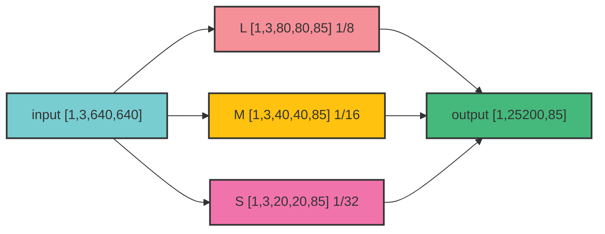

## 使用 CV::DNN 模块读取 YOLO v5 ONNX 模型进行实时目标检测
### 运行环境
name | version 
---------|----------
 System | **[Ubuntu 20.04](https://wiki.ubuntu.com/FocalFossa/ReleaseNotes/)**
 CMake  | **[3.10](https://cmake.org/)** ≥
 OpenCV | **[4.5.0](https://github.com/opencv/opencv/releases/tag/4.5.0)**
 Python | **[3.8.0](https://www.python.org/downloads/release/python-380/)**
 YOLOv5 | **[v6.0](https://github.com/ultralytics/yolov5/releases/tag/v6.0)**

### 获取 ONNX 模型

**[`OpenCV-DNN`](https://docs.opencv.org/4.5.0/d6/d0f/group__dnn.html#ga3b34fe7a29494a6a4295c169a7d32422)** 模块支持直接导入 **`ONNX`** 的模型文件，需要编译时同时编译 **[`opencv_contrib`](https://github.com/opencv/opencv_contrib)** 模块

**[yolov5](https://github.com/ultralytics/yolov5)** 提供了已训练模型的导出脚本 **[`export.py`](https://github.com/ultralytics/yolov5/blob/master/export.py)**，支持从 pytorch 导出为 `onnx`，`torchscript`，`TF pb` 等格式

- **[TFLite, ONNX, CoreML, TensorRT Export #251](https://github.com/ultralytics/yolov5/issues/251)**

#### 导出 `.onnx` 文件

**下载 **[yolov5-v6.0](https://github.com/ultralytics/yolov5/releases/tag/v6.0)** 源码**

``` bash
wget -O yolov5-6.0.tar.gz https://github.com/ultralytics/yolov5/archive/refs/tags/v6.0.tar.gz
tar -zxvf yolov5-6.0.tar.gz  # 解压
cd yolov5-6.0
pip install -r requirements.txt  # 安装依赖 
```
- 如果使用 `conda`，安装依赖前先激活 `conda` 环境

**安装 `onnx`**

``` bash
pip install --upgrade onnx
```

**下载预训练模型**

``` bash
sh data/scripts/download_weights.sh # 会下载所有种类的模型
# 这里只会用到 yolov5s.pt 也可单独下载
wget https://github.com/ultralytics/yolov5/releases/download/v6.0/yolov5s.pt
```
- 之后在 `yolov5` 根目录会有下载好的 `.pt`模型文件

**转换模型**

由于 `OpenCV` 版本选择的是 `4.5.0`，在直接导出 `onnx` 模型后，加载时会出现未知的错误，需要对 **[`export.py`](https://github.com/ultralytics/yolov5/blob/master/export.py)** 中的内容进行一些改动

找到 **`export.py`** 中的 **[parser.add_argument('--opset', type=int, default=13, help='ONNX: opset version')](https://github.com/ultralytics/yolov5/blob/master/export.py#L582)** 这一行

将 `default` 的值由 `13` 修改为 `12`

``` py
def parse_opt():
    ···
    parser.add_argument('--opset', type=int, default=12, help='ONNX: opset version')
    ···
    return opt
```

``` py 
def parse_opt():
    ···
    parser.add_argument('--opset', type=int, default=12, help='ONNX: opset version')
    ···
    return opt
```

- 再执行模型转换

``` bash
python3.8 export.py --data data/coco128.yaml --weights yolov5s.pt --include onnx
```

最终得到 `yolov5s.onnx` 文件，将作为我们使用 **`OpenCV-DNN`** 模块导入的模型文件

:::info
v6.0 版本的 `export.py` 文件为 `default=13`

- pytho3.8 对应安装的 onnx 版本为  onnx-1.12.0 ，所以应修改为 `default=12`

v6.1 版本的 `export.py` 文件则被修改为 `default=12` 如果使用 
v6.1 版本应该可以跳过修改文件的步骤
:::

### OpenCV-DNN 导入 ONNX 模型

先来看看模型转换后的网络结构，推荐使用 **[`Netron Viewer`](https://github.com/lutzroeder/netron)** 来进行网络结构的可视化，此工具支持大部分框架的网络结构可视化，并且能的获取单个节点的信息

#### 关键参数

首先是模型转换后的一些会用到的参数设置，这里以 `yolov5s` 常用的 `640x640` 分辨率 以及 `coco128` 数据集为例

对于 `yolov5s.onnx` 文件


- 输入节点维度为 **`float32[1,3,640,640]`** ，为分辨率 `640x640` 的 `RGB` 三通道图片



- 输出节点维度为 **`float32[1,25200,85]`** ，为所有尺寸输出的集合

可以获得三个参数

``` cpp
float resolution;       // 640 x 640
int output_dimensions;  // 85
int output_rows;        // 25200
```

**`resolution` 为分辨率，这里为 `640x640`**

**`output_dimensions` 为每个目标所占范围 `5 + classnames`**
- **5** 对应 `x`、`y`、`w`、`h`、`confidences`，分别描述物体位置以及框内是否有物体的置信度
- `classnames` 对应数据集中每种分类所对应的置信度，这里使用 `coco128` 数据集，所以为 **80**

**`output_rows` 为输出节点的维度，也可以理解为数组的长度，分别对应**
- `layer 345 output resolution*1/8`
- `layer 403 output resolution*1/16`
- `layer 461 output resolution*1/32`
- $25200=3*(80^2 + 40^2 + 20^2)$

### Class YoloNet()

``` cpp title="yolov5_onnx.hpp"
#include <fstream>
#include <math.h>
#include <opencv2/opencv.hpp>

namespace yolov5_onnx{

struct Detection
{
    int class_id;
    float confidence;
    cv::Rect bbox;
};


class Net
{
public:
    /**
     * @brief Construct a new Net object
     * 
     * @param onnx_model_path yolov5 onnx model file path
     * @param class_list_path class_list file path
     * @param is_cuda is CUDA supported
     */
    Net(std::string onnx_model_path, 
        std::string class_list_path, 
        const float resolution,
        bool is_cuda = false);
    /**
     * @brief Destroy the Net object
     * 
     */
    ~Net();

    /**
     * @brief 
     * 
     * @param src 
     * @param _score_threshold 
     * @param _NMS_threshold 
     * @param _confidence_threshold 
     * @return std::vector<yolov5_onnx::Detection> 
     */
    std::vector<yolov5_onnx::Detection> detect(cv::Mat &src,
                                    float _score_threshold = 0.2,
                                    float _NMS_threshold = 0.4,
                                    float _confidence_threshold = 0.4);

    cv::Mat format_img(const cv::Mat &src);

    inline std::vector<std::string> classList(){
        return this->class_list;
    }

private:
    cv::dnn::Net net;
    std::vector<std::string> class_list;
    
    float resolution;
    int output_dimensions;
    int output_rows;
};

} // namespace yolov5_onnx
```

```cpp title="yolov5_onnx.cpp"
#include "yolov5_onnx/yolov5_onnx.hpp"

namespace yolov5_onnx{

Net::Net(   std::string onnx_model_path, 
            std::string class_list_path, 
            const float RESOLUTION,
            bool is_cuda)
{
    // load model
    this->net = cv::dnn::readNet(onnx_model_path);
    if (is_cuda)
    {
        std::cout << "Attempty to use CUDA\n";
        net.setPreferableBackend(cv::dnn::DNN_BACKEND_CUDA);
        net.setPreferableTarget(cv::dnn::DNN_TARGET_CUDA_FP16);
    }
    else
    {
        std::cout << "Running on CPU\n";
        net.setPreferableBackend(cv::dnn::DNN_BACKEND_OPENCV);
        net.setPreferableTarget(cv::dnn::DNN_TARGET_CPU);
    }

    // load class_list
    std::ifstream ifs(class_list_path);
    std::string line;
    while (getline(ifs, line))
    {
        this->class_list.push_back(line);
    }

    this->resolution = RESOLUTION;

    this->output_dimensions = 5 + this->class_list.size();
    this->output_rows = 3 *(pow(this->resolution/8,2) + pow(this->resolution/16,2) + pow(this->resolution/32,2)) ;

}

std::vector<yolov5_onnx::Detection> Net::detect(cv::Mat &src,
                                    float _score_threshold,
                                    float _NMS_threshold,
                                    float _confidence_threshold){
    cv::Mat blob;
    cv::Mat input = this->format_img(src);
    cv::dnn::blobFromImage(input, blob, 1./255., cv::Size(this->resolution, this->resolution), cv::Scalar(0,0,0), true, false);
    net.setInput(blob);
    std::vector<cv::Mat> outputs;
    net.forward(outputs, net.getUnconnectedOutLayersNames());

    float x_factor = input.cols / this->resolution;
    float y_factor = input.rows / this->resolution;

    float *data = (float *)outputs[0].data;

    std::vector<int> class_ids;
    std::vector<float> confidences;
    std::vector<cv::Rect> boxes;

        for (int i = 0; i < this->output_rows; ++i) {

        float confidence = data[4];
        if (confidence >= _confidence_threshold) {

            float * classes_scores = data + 5;
            cv::Mat scores(1, this->class_list.size(), CV_32FC1, classes_scores);
            cv::Point class_id;
            double max_class_score;
            minMaxLoc(scores, 0, &max_class_score, 0, &class_id);
            if (max_class_score > _score_threshold) {

                confidences.push_back(confidence);

                class_ids.push_back(class_id.x);

                float x = data[0];
                float y = data[1];
                float w = data[2];
                float h = data[3];
                int left = int((x - 0.5 * w) * x_factor);
                int top = int((y - 0.5 * h) * y_factor);
                int width = int(w * x_factor);
                int height = int(h * y_factor);
                boxes.push_back(cv::Rect(left, top, width, height));
            }

        }
        data += this->output_dimensions;
    }
    
    std::vector<Detection> output;
    std::vector<int> nms_result;
    cv::dnn::NMSBoxes(boxes, confidences, _score_threshold, _NMS_threshold, nms_result);
    for (size_t i = 0; i < nms_result.size(); i++) {
        int idx = nms_result[i];
        Detection result;
        result.class_id = class_ids[idx];
        result.confidence = confidences[idx];
        result.bbox = boxes[idx];
        output.push_back(result);
    }

    return output;
}

cv::Mat Net::format_img(const cv::Mat &src){
    int format_size = src.cols > src.rows ? src.cols:src.rows;
    cv::Mat dst = cv::Mat::zeros(cv::Size(format_size, format_size), CV_8UC3);
    src.copyTo(dst(cv::Rect(0, 0, src.cols, src.rows)));
    
    return dst;
}

} // namespace yolov5_onnx
```

**`yolov5_onnx::Detection` 用于存放检测结果的结构体**
- `class_id` 物体的类别
- `confidence` 置信度
- `bbox` 位置的矩形 boundingBox

**`yolov5_onnx::Net::format_img` 预处理输入图片**

**` cv::dnn::blobFromImage()`** 函数虽然能自己处理输入的图片，但是如果输入的图片不是等宽的，压缩结果就会影响检测结果的输出，这里的处理方法就是以输入图像的长边创建一张黑色的图像，然后将输入图像尺寸的ROI区域设置为输入图像，这样就保证输入图像一定是等宽的，能保证检测结果，并且不需要对检测结果的 `boundingBox` 的位置再进行处理


``` cpp title="main.cpp"
#include <opencv2/opencv.hpp>
#include "yolov5_onnx/yolov5_onnx.hpp"

int main(){
    yolov5_onnx::Net yolo("{path}/yolov5-6.0/yolov5s.onnx",
                            "{path}/yolov5-6.0/classes.txt",
                            640);
    const std::vector<cv::Scalar> colors = {cv::Scalar(255, 255, 0), cv::Scalar(0, 255, 0), cv::Scalar(0, 255, 255), cv::Scalar(255, 0, 0)};

    cv::Mat src_img = cv::imread("{path}yolov5-6.0/data/images/bus.jpg");

    // YOLO detect
    std::vector<yolov5_onnx::Detection> result =  yolo.detect(src_img);
    for (size_t i = 0; i < result.size(); ++i)
    {

        auto detection = result[i];
        auto bbox = detection.bbox;
        auto classId = detection.class_id;
        const auto color = colors[classId % colors.size()];
        cv::rectangle(color_img, bbox, color, 3);

        cv::rectangle(color_img, cv::Point(bbox.x, bbox.y - 20), cv::Point(bbox.x + bbox.width, bbox.y), color, cv::FILLED);
        cv::putText(color_img, yolo.classList()[classId].c_str(), cv::Point(bbox.x, bbox.y - 5), cv::FONT_HERSHEY_SIMPLEX, 0.5, cv::Scalar(0, 0, 0));
    }

    cv::imshow("color_img", color_img);

    cv::waitKey(0);
    
    return 0;
}
```

最终输出结果如下


使用 CPU 推理，帧率比较感人，者尝试使用 `ONNX onnxruntime` 或者 `openvino` 加速推理，可以显著提升推理速度

或者尝试降低网络的分辨率，牺牲一些检测的精度，以大幅度提高检测的速度

## 参考

- **[ultralytics/yolov5](https://github.com/ultralytics/yolov5)**
- **[TFLite, ONNX, CoreML, TensorRT Export #251](https://github.com/ultralytics/yolov5/issues/251)**
- **[Netron Viewer](https://github.com/lutzroeder/netron)**
- **[Hexmagic/ONNX-yolov5](https://github.com/Hexmagic/ONNX-yolov5)**
- **[yolov5-opencv-cpp-python](https://github.com/doleron/yolov5-opencv-cpp-python)**
- **[2021.11.01 c++下 opencv部署yolov5-6.0版本 (四)](https://blog.csdn.net/qq_34124780/article/details/121079317)**
- **[opencv dnn模块实现Yolov5_6.1](https://blog.csdn.net/dongjuexk/article/details/124243178)**
- **[hong3731/yolov5-opencv](https://github.com/hong3731/yolov5-opencv)**